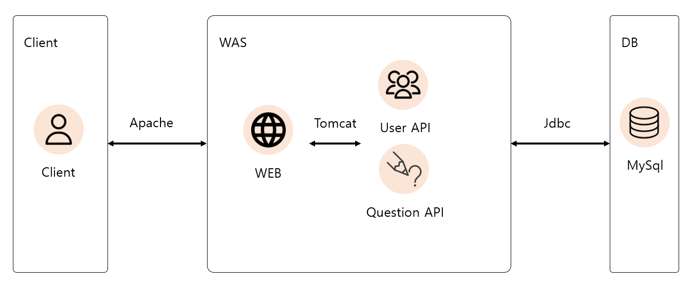
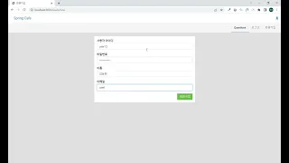

# Spring Cafe

## 목차

1. [프로젝트 설명](#1-프로젝트-설명)
2. [cafe 기능](#2-cafe-기능)
3. [아키텍처](#3-아키텍처)
4. [데모 영상](#4-데모-영상)
5. [문서 링크](#5-문서-링크)
6. [Docker](#6-docker)
7. [Wiki](#7-wiki)

## 1. 프로젝트 설명

### 1.1 프로젝트 기획

> 질문 게시글을 올리기 위한 게시판

### 1.2 프로젝트 목적

- 스프링 프레임워크 원리 이해
- 로그인 및 회원가입 구현으로 인한 세션 이해
- JDBC를 이용한 데이터베이스 연결
- 게시판 및 댓글에 대한 이해
- 페이지네이션 구현으로 인한 원리 이해

## 2. cafe 기능

- 회원가입 및 로그인
- 회원 정보 관리
- 게시글 글쓰기
- 게시글 관리
- 댓글 관리

## 3. 아키텍처



### 기술스택

- Spring Boot
- Thymeleaf
- MySQL

## 4. 데모 영상

[](https://www.youtube.com/watch?v=cZ0-cmonoeY)

## 5. 문서 링크

- [API 문서](https://yonghwans-organization.gitbook.io/cafe/reference/api-reference/users)

## 6. Docker

```bash
be-java-cafe-max $ ./gradlew clean build
be-java-cafe-max $ docker-compose up -d --build
```

## 7. Wiki

- [학습계획](https://github.com/yonghwankim-dev/be-java-cafe-max/wiki/%ED%95%99%EC%8A%B5%EA%B3%84%ED%9A%8D)
- [요구사항분석](https://github.com/yonghwankim-dev/be-java-cafe-max/wiki/%EC%9A%94%EA%B5%AC%EC%82%AC%ED%95%AD%EB%B6%84%EC%84%9D)
- [문제해결](https://github.com/yonghwankim-dev/be-java-cafe-max/wiki/%EB%AC%B8%EC%A0%9C%ED%95%B4%EA%B2%B0)
- [학습내용](https://github.com/yonghwankim-dev/be-java-cafe-max/wiki/%ED%95%99%EC%8A%B5%EB%82%B4%EC%9A%A9)
